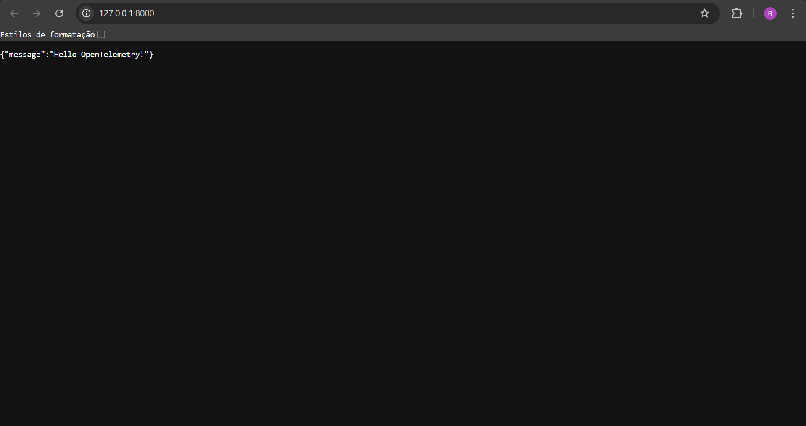
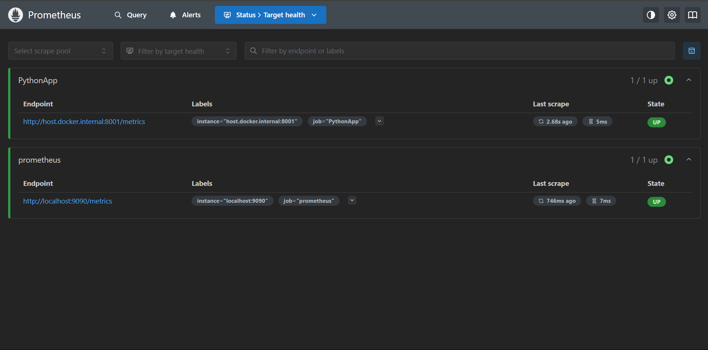
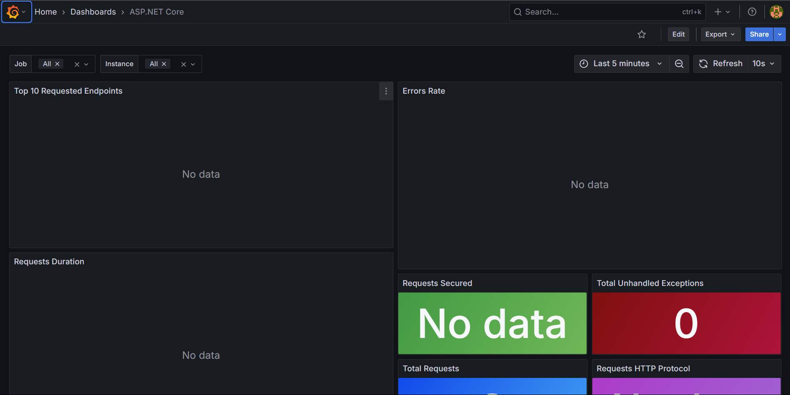
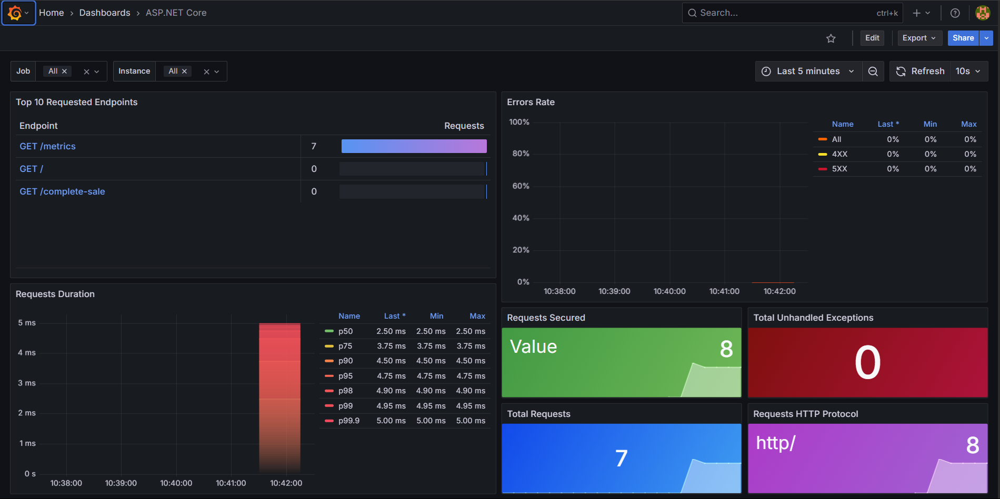

# Observabilidade com Prometheus, Grafana e FastAPI

## Objetivo

Recriar o sistema de métricas do ASP.NET Core com OpenTelemetry e Prometheus, substituindo a aplicação .NET por uma aplicação Python utilizando FastAPI, expondo métricas compatíveis com dashboards do Grafana originalmente voltados para .NET.


## Estrutura da Stack

```plaintext
.
├── docker-compose.yml
├── Dockerfile
├── prometheus.yml
├── requirements.txt
├── grafana/
│   ├── dashboards/
│   │   └── 19924_rev5.json
│   └── provisioning/
│       └── dashboards.yml
└── app.py
```

<br>

## Implementação

### Aplicação FastAPI com Métricas

&emsp;&emsp; Inicialmente, foi criada uma aplicação FastAPI que expõe métricas compatíveis com o dashboard do ASP.NET Core. As métricas são coletadas usando o Prometheus Client para Python, e a aplicação é configurada para exportar essas métricas em um endpoint específico. A aplicação é iniciada com o comando `uvicorn app:app`.

<br>

#### app.py



#### Metrics Page


```python

### Docker Compose

&emsp;&emsp; O `docker-compose.yml` foi configurado para orquestrar os serviços do Grafana e do Prometheus. O Grafana é configurado para inicializar usando automaticamente um dashboard pré-setado, sendo um dos modelos disponibilizados pelo próprio ASP.NET Core, adaptado para as métricas do FastAPI. O Prometheus é configurado para coletar métricas da aplicação FastAPI através de um endpoint específico.

```yaml
services:
  grafana:
    image: grafana/grafana-oss:latest
    ports:
      - "3000:3000"
    environment:
      - GF_SECURITY_ADMIN_USER=admin
      - GF_SECURITY_ADMIN_PASSWORD=admin
    volumes:
      - grafana-data:/var/lib/grafana
      - ./grafana/dashboards:/etc/grafana/dashboards:ro
      - ./grafana/provisioning:/etc/grafana/provisioning:ro
    networks:
      - monitoring

  prometheus:
    image: prom/prometheus:latest
    ports:
      - "9090:9090"
    volumes:
      - ./prometheus.yml:/etc/prometheus/prometheus.yml
    networks:
      - monitoring

  app:
    build: ./app
    ports:
      - "8000:8000"
      - "8001:8001"  # Porta do exportador Prometheus
    networks:
      - monitoring

volumes:
  grafana-data:

networks:
  monitoring:
    driver: bridge
```
<br>

#### Prometheus


#### Grafana

---

### Métricas Prometheus no FastAPI

| Nome da Métrica                               | Tipo      | Labels                                    | Descrição                                                 |
| --------------------------------------------- | --------- | ----------------------------------------- | --------------------------------------------------------- |
| `http_server_request_duration_seconds`        | Histogram | `http_request_method`, `http_route`       | Duração das requisições HTTP. Inclui métricas auxiliares: |
| `http_server_request_duration_seconds_bucket` | Counter   | `le`, `http_request_method`, `http_route` | Contador acumulado por faixa de tempo (buckets)           |
| `http_server_request_duration_seconds_count`  | Counter   | `http_request_method`, `http_route`       | Total de requisições observadas                           |
| `http_server_request_duration_seconds_sum`    | Counter   | `http_request_method`, `http_route`       | Soma total dos tempos de requisição                       |
| `http_server_active_requests`                 | Gauge     | `http_request_method`, `http_route`       | Número de requisições em andamento                        |
| `contoso_product_sold_total`                  | Counter   | `product_name`                            | Total de unidades vendidas por produto                    |


## Demonstração dos Gráficos

&emsp;&emsp; Abaixo estão listados os gráficos que foram criados no Grafana, utilizando as métricas coletadas da aplicação FastAPI. Esses gráficos são baseados no modelo original do ASP.NET Core, adaptados para refletir as métricas da nova aplicação.



### Top 10 Requested Endpoints

* **Tipo:** Tabela
* **Métrica base:** `http_server_request_duration_seconds_count`
* **Query:** `topk(10, sum by (http_route, http_request_method) (increase(...)))`
* **Descrição:** Exibe os 10 endpoints mais acessados, ordenados pela quantidade de requisições recebidas no intervalo de tempo selecionado.
* **Utilidade em produção:** Identificar rotas populares ou de alto tráfego.

---

### **Errors Rate**

* **Tipo:** Timeseries (linha)
* **Métricas:**

  * `4XX` → Erros do cliente
  * `5XX` → Erros do servidor
* **Cálculo:** Taxa de erro (`4xx` ou `5xx`) sobre o total de requisições, usando `rate(http_server_request_duration_seconds_bucket)`
* **Descrição:** Mostra a porcentagem de requisições com erro (4XX ou 5XX) ao longo do tempo.
* **Utilidade em produção:** Identificar degradação na qualidade de serviço.

---

### **Requests Duration (p50–p99.9)**

* **Tipo:** Timeseries
* **Métrica:** `http_server_request_duration_seconds_bucket`
* **Função:** `histogram_quantile()`
* **Quantis:** `p50`, `p75`, `p90`, `p95`, `p98`, `p99`, `p99.9`
* **Descrição:** Mostra a distribuição da duração das requisições HTTP, ajudando a visualizar a latência em diferentes percentis.
* **Utilidade em produção:** Detectar latência em picos de uso.

---

### **Current Requests**

* **Tipo:** Timeseries
* **Métrica:** `http_server_active_requests`
* **Query:** `sum(http_server_active_requests)`
* **Descrição:** Exibe em tempo real o número de requisições ativas (em andamento).
* **Utilidade em produção:** Identificar gargalos ou lentidão em tempo real.

---

### **Top 10 Unhandled Exception Endpoints**

* **Tipo:** Tabela
* **Métrica:** `http_server_request_duration_seconds_count` (com label `error_type`)
* **Query:** similar à dos top endpoints, mas filtrando onde `error_type != ""`
* **Descrição:** Lista os 10 endpoints que mais geraram exceções não tratadas.
* **Utilidade em produção:** Depuração e qualidade do código.

---

### **Total Requests**

* **Tipo:** Stat (valor único)
* **Métrica:** `http_server_request_duration_seconds_count`
* **Cálculo:** `sum(ceil(increase(...)))`
* **Descrição:** Mostra o número total de requisições feitas durante o período.
* **Utilidade em produção:** Métrica geral de atividade da API.

---

### **Requests Secured**

* **Tipo:** Stat
* **Métrica:** `http_server_request_duration_seconds_count` com label `url_scheme`
* **Descrição:** Mostra o total de requisições separadas por protocolo (`http` vs `https`)
* **Utilidade em produção:** Verificar a adoção de conexões seguras (HTTPS).

---

### **Total Unhandled Exceptions**

* **Tipo:** Stat
* **Métrica:** `http_server_request_duration_seconds_count` com label `error_type`
* **Descrição:** Mostra o total de requisições com erro não tratado.
* **Utilidade em produção:** Alertar falhas de runtime que não foram interceptadas por tratamento de exceções.

---

### **Requests HTTP Protocol**

* **Tipo:** Stat
* **Métrica derivada:** Substitui `network_protocol_version` por `http/1.1`, etc.
* **Descrição:** Classifica requisições por versão do protocolo HTTP usado.
* **Utilidade em produção:** Compatibilidade, migração entre versões (ex: HTTP/2).
